<h1 align="center"><a href="https://github.com/ModdingTF2/The-closest-thing-to-an-updated-version-of-TF2-TIP" title="Team Fortress 2 Texture Improvement Project">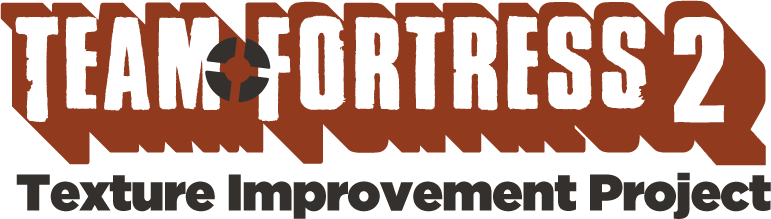</a> The closest thing to an updated version of TF2 TIP</h1>

## What is this?

A continuation of [NassimO & Blaholtzen's Team Fortress 2 Texture Improvement Project](https://facepunch.com/showthread.php?t=1251249).

Uses the [Cleanup](https://facepunch.com/showthread.php?t=1251249&p=43119383&viewfull=1#post43119383) files as a base and adds onto it with updates from [Facepunch](https://facepunch.com/) and [GameBanana](https://gamebanana.com/).

## What does it do?

### • Fixes shading artifacts:

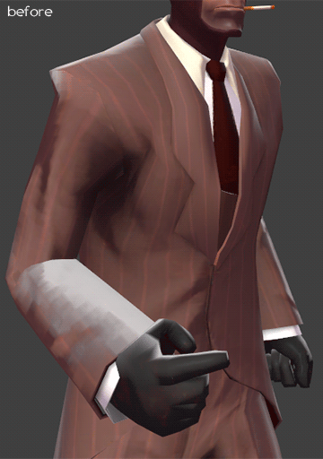

### • Improved textures:

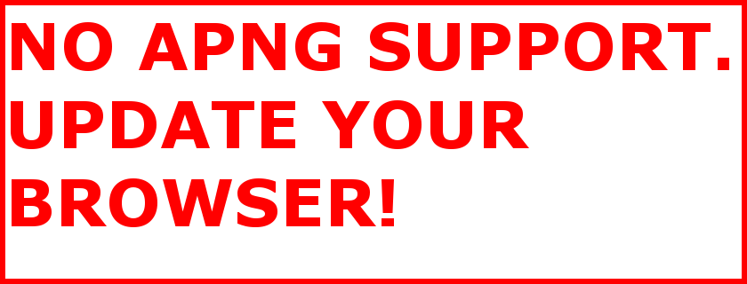

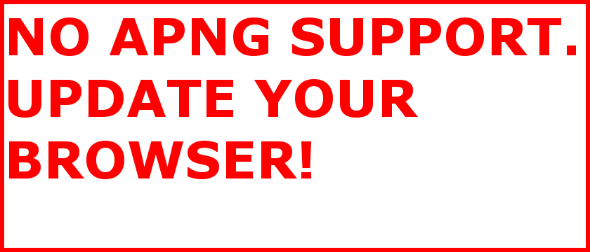

### • Delicous gibs:

Click on a model to view it on [p3d.in](https://p3d.in/). (Phong isn't 100% acurate to ingame.)

<table><tbody><tr>
<td align="center"><a href="https://p3d.in/TWqOT/spin" title="Heavy Gibs">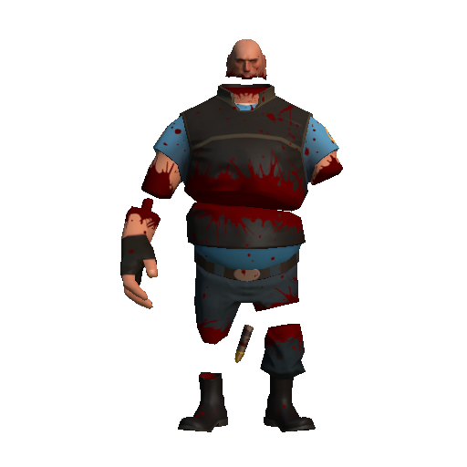 https://p3d.in/TWqOT/spin</a></td>
<td align="center"><a href="https://p3d.in/AJ528/spin" title="Scout Gibs">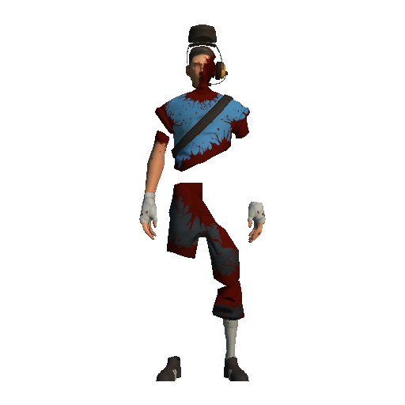 https://p3d.in/AJ528/spin</a></td>
<td align="center"><a href="https://p3d.in/nM5W1/spin" title="Demoman Gibs">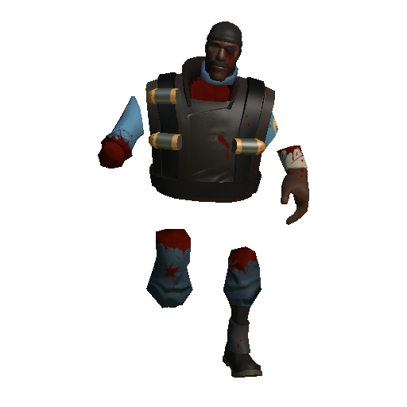 https://p3d.in/nM5W1/spin</a></td>
</tr></tbody><tbody><tr>
<td align="center"><a href="https://p3d.in/7PL6y/spin" title="Soldier Gibs">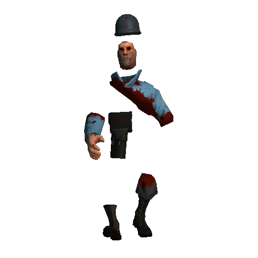 https://p3d.in/7PL6y/spin</a></td>
<td align="center"><a href="https://p3d.in/337SY/spin" title="Pyro Gibs">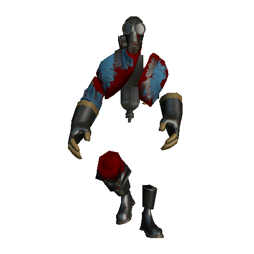 https://p3d.in/337SY/spin</a></td>
<td align="center"><a href="https://p3d.in/UrTRQ/spin" title="Sniper Gibs">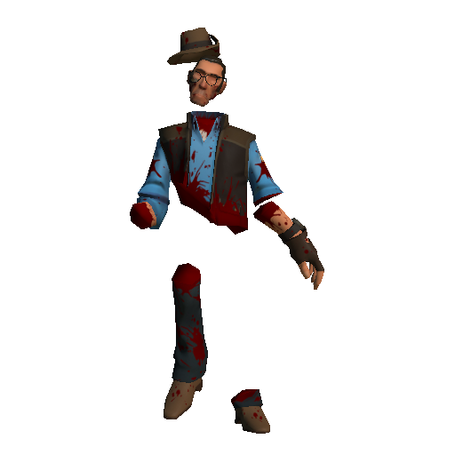 https://p3d.in/UrTRQ/spin</a></td>
</tr></tbody><tbody><tr>
<td align="center"><a href="https://p3d.in/j5RWU/spin" title="Engineer Gibs">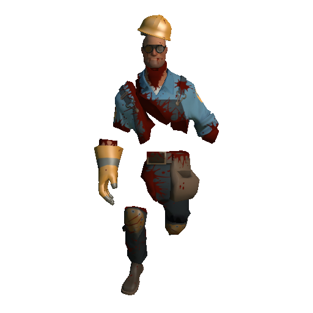 https://p3d.in/j5RWU/spin</a></td>
<td align="center"><a href="https://p3d.in/Iprjy/spin" title="Medic Gibs">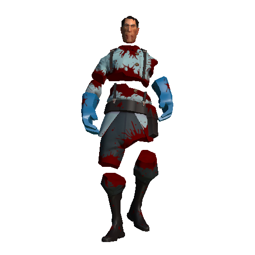 https://p3d.in/Iprjy/spin</a></td>
<td align="center"><a href="https://p3d.in/zobg0/spin" title="Spy Gibs">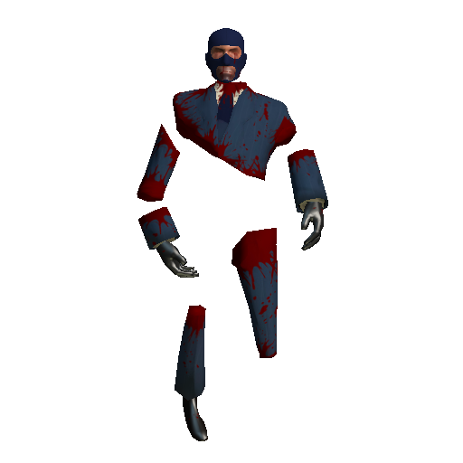 https://p3d.in/zobg0/spin</a></td>
</tr></tbody></table>

## Credits

Thank you *Valve* for making **Team Fortress 2**!

Thank you *Blaholtzen*, *NassimO*, *Hecates*, *Murphy*, *NeoDement*, *Agent Fedora*, *Chaofanatic*, *Shugo*, and *Sexy Robot* for the original **Texture Improvement Project**!

Thank you *CheezKurds* for the **SFM Breadmonster Textures**!

Thank you *DioJoestar* for the **Realistic Bunsen Brave**, **Realistic Bootleg Base Metal Billycock**, **Realistic HDMI Patch**, **Slow Pulse Effect - Tungsten Toque**, **Slow Pulse Effect - Filamental**, **Slow Pulse Bolt Boy**, and **Slow Pulse - Googol Glass Eyes**!

Thank you *Filipianosol* for the **TF2TIP Cleanup**!

Thank you *FiveEyes* and *Metabolic* for the original **Starboard Crusader** model!

Thank you *FiveEyes* for the **Buff Banner Bugle Phong Fix**!

Thank you *Gabrielwoj* for the **Fixed Vaccinator BLU Team Visor**, **Fixed Chieftain's Challenge Paint**, **Fixed Stereoscopic Shades**, **Requested Alternative Paintable Area/Fix #1**, **Valley Forge - Red Team Fix**, **Slick Cut Improvements**, **Medical Mystery - Pack of Fixes**, **Das Fantzipantzen - Alternative Paint Area**, **Black Watch Improvements**, **Smock Surgeon - BLU Team Fix** , **Paintable Pencil Pusher**, **Law Fix**, **The Dictator Fix**, **Alternate Color Schemes #1**, **Alternate Color Schemes #2**, **Team Colored Fire Axe**, **Team Colored Deep Fried Desire**, and **Cream Spirit Maul**!

Thank you *Hawkshadow741* for the **2013 Festive Fixes** and **A&B Beep Boy and Beep Man**!

Thank you *Hecates* for the **TIP HD Gibs**!

Thank you *Hellview24* for the **Cut Throat Concierge Texture Fix** and **Cockswain's Mutton Chops Paint Improvements**!

Thank you *Mudley* for the **Shotgun Shells Texture Fix**, **Red Shells for BLU Slo-Poke**, **BLUEprints for RED Engineer**, **Lucky Shot Color Fix**, **Sentry Rockets Texture Fix**, and **Blue Pants for ScoutBot**!

Thank you *Rlaro* for the **Animated Heavy Shells**!

Thank you *Stachekip* for the **Beta Minigun Casings (Animated)**!

## Why?

Because this is the current state of the original project:

<a href="http://steamcommunity.com/groups/tf2tip#announcements/detail/1585530588971964312" title="Pre-release 4 coming soon">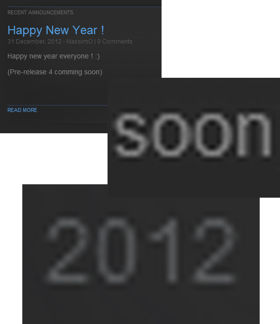</a>

